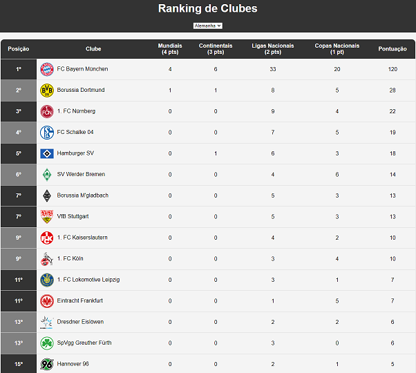

# Ranking de Clubes 
Pequeno projeto que fiz pois tinha curiosidade quanto aos títulos de clubes de vários países e queria compará-los.

Utilizei como oportunidade para aprender um pouquinho de SpringBoot e AngularJS (o qual atualmente tenho de utilizar no trabalho).

O ranking leva em conta apenas os títulos considerados de primeiro escalão. Mais informações sobre quais competições são consideradas podem ser obtidas no próprio ranking ao clicar nos itens de cabeçalho da tabela.

O resultado pode ser conferido [aqui](https://hamilton-santos.github.io/Ranking-de-Clubes).

## Créditos
[ChatGPT](https://chat.openai.com): layout html base.

[Sofascore](https://sofascore.com): escudos e nomes de clubes.

[SVG Repo](https://svgrepo.com): ícone da página.

[Wikipedia](https://pt.wikipedia.org): dados dos campeonatos.